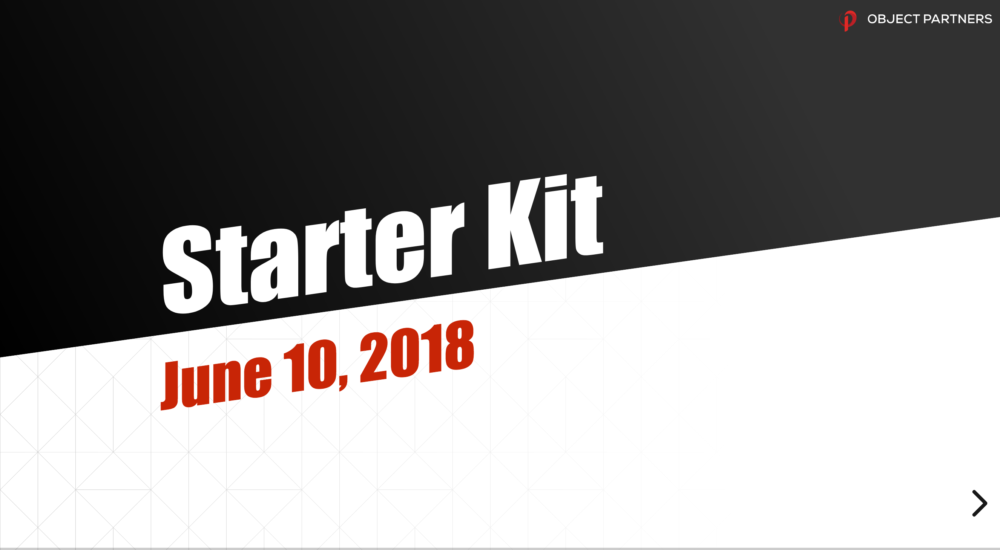

# presentation-starter-kit

A presentation starter kit to get up and running with an OPi branded presentation quicky and easily. Also see [workshop-starter-kit][workshop-starter-kit].



## Set up

1. Clone this repo
1. Run `yarn` or `npm install` to install dependencies
1. `yarn start` or `npm start` to start a local http server on port 3000

## Adding slides

Markdown is the preferred authoring language for authoring slides. To add additional slides, simply create a `.md` file in src/slides and it'll be picked up automatically by the slide deck. For instance, let's walk through adding a new section of slides.

### Adding a new section

To keep things nice and tidy, I recommend using folders of slides, e.g. [`src/slides/00-intro`](./src/slides/00-intro) as an example. To create a new section, simply create a new folder, e.g. `mkdir -p src/slides/01-getting-started`. Inside, we can add a markdown file, e.g. `touch src/slides/01-getting-started/00-index.md`. The slides within are sorted in alphanumeric order so that sort order remains in the slide deck what it is on the local file system.

### Adding a set of slides

We're using Reveal.js, which contains support for "groups" of slides to logically group within an individual unit. To support this, we use Markdown breaks, e.g. `---` or `___` to separate individual slides. Let's look at an example.

```md
## First slide

This is the first slide

---

## This is a second slide

This will be the second slide!
```

Using the break `---` we have created two, separate slides, which works pretty well! Additionally, all the niceties of Markdown remain, e.g. syntax highlighting with backticks in particular. If you'd like to add additional languages to the syntax highlighter, please do so in [`src/components/slide-deck/slide-deck.js`](./src/components/slide-deck/slide-deck.js)

## Deploying the Presentation

As static content, you can use whatever you please to host the resulting presentation. I would recommend using Netlify, which is a great, free static content host. To deploy to Netlify, simply:

1. Create a new repo under either objectpartners group or your own account--consider making it public!
1. Go to [netlify][netlify] and add the repo
  - No settings need to be tweaked. [netlify.toml](./netlify.toml) is already in the root of this repo, and so the default settings can be used.
1. Watch the site deploy to your randomized domain

This will get you a free, statically hosted presentation with a friendly URL in front of it that can be easily shared to training attendees. 🎉 You can easily put a CNAME in front of your hosting provider to redirect to your own URL, if desired.

[workshop-starter-kit]: https://github.com/objectpartners/workshop-starter-kit
[netlify]: https://netlify.com
